# Samved Healthcare Management System

## 🏥 Project Overview
Samved is a comprehensive healthcare management system designed to streamline hospital operations, citizen healthcare services, and administrative management. The platform enables seamless interaction between administrators, hospitals, doctors, and citizens.

---

## 🛠️ Tech Stack

### **Backend Technologies**
- **Runtime Environment:** Node.js
- **Web Framework:** Express.js v5.2.1
- **Database:** MongoDB (NoSQL)
- **ODM (Object Data Modeling):** Mongoose v9.1.5
- **Authentication:** Passport.js with Passport-Local Strategy
- **Password Encryption:** BCrypt v6.0.0
- **Session Management:** Express-Session v1.19.0

### **Frontend Technologies**
- **Template Engine:** EJS (Embedded JavaScript) v4.0.1
- **Styling:** HTML5, CSS3
- **Client-Side:** JavaScript

### **Middleware & Utilities**
- **File Upload:** Multer v2.0.2
- **PDF Generation:** PDFKit v0.17.2
- **Flash Messages:** Connect-Flash v0.1.1
- **Environment Variables:** Dotenv v17.2.3

### **Development Tools**
- **Development Server:** Nodemon v3.1.11

---

## 🏗️ System Architecture

### Architecture Diagram

```mermaid
graph TB
    subgraph "Client Layer"
        A[Web Browser]
    end
    
    subgraph "Presentation Layer"
        B[EJS Templates]
        B1[Views: Home, Login, Register]
        B2[Dashboards: Admin, Hospital, Citizen]
        B3[Hospital Management Views]
        B4[Citizen Profile Views]
    end
    
    subgraph "Application Layer - Node.js/Express"
        C[Express Server]
        D[Middleware Layer]
        D1[Passport.js Authentication]
        D2[Express Session]
        D3[Multer File Upload]
        D4[Auth Middleware]
        
        E[Routes]
        E1[Auth Routes]
        E2[Admin Routes]
        E3[Hospital Routes]
        E4[Citizen Routes]
        
        F[Controllers]
        F1[Admin Controller]
        F2[Hospital Controller]
        F3[Citizen Controller]
    end
    
    subgraph "Business Logic Layer"
        G[Models - Mongoose ODM]
        G1[User Model]
        G2[Hospital Model]
        G3[Doctor Model]
        G4[Patient Model]
        G5[Appointment Model]
        G6[Equipment Model]
        G7[Medicine Model]
        G8[Outbreak Model]
        G9[Notification Model]
    end
    
    subgraph "Data Layer"
        H[(MongoDB Database)]
    end
    
    subgraph "Security Layer"
        I[BCrypt Password Hashing]
        J[Passport Local Strategy]
        K[Session Management]
    end
    
    subgraph "Utilities"
        L[PDFKit - PDF Generation]
        M[Connect-Flash Messages]
        N[Dotenv - Config Management]
    end
    
    A -->|HTTP Request| C
    C --> D
    D --> D1 & D2 & D3 & D4
    D --> E
    E --> E1 & E2 & E3 & E4
    E1 & E2 & E3 & E4 --> F
    F --> F1 & F2 & F3
    F --> G
    G --> G1 & G2 & G3 & G4 & G5 & G6 & G7 & G8 & G9
    G --> H
    C --> B
    B --> B1 & B2 & B3 & B4
    B -->|HTML Response| A
    D1 --> I & J & K
    F --> L & M
    C --> N
    
    style A fill:#e1f5ff
    style C fill:#fff4e1
    style H fill:#e8f5e9
    style I fill:#ffebee
    style J fill:#ffebee
    style K fill:#ffebee
```



---

## 📋 Architecture Explanation

### **1. Client Layer**
The client layer consists of web browsers that users interact with to access the healthcare management system. This layer sends HTTP requests and receives HTML responses rendered by the server.

### **2. Presentation Layer (View)**
- **EJS Template Engine:** Handles server-side rendering of dynamic HTML pages
- **View Components:**
  - **Authentication Views:** Login and Registration pages
  - **Dashboard Views:** Role-specific dashboards for Admin, Hospital, and Citizen users
  - **Hospital Management Views:** Doctor management, patient records, analytics, prescriptions, and resource tracking
  - **Citizen Views:** Personal profile management and health records
  - **Layout System:** Main layout with reusable partials (navbar, footer)

### **3. Application Layer (Controller)**
- **Express.js Server:** Core application server running on port 3000
- **Middleware Layer:**
  - **Passport.js Authentication:** Handles user authentication and authorization
  - **Express Session:** Manages user sessions with secure cookies
  - **Multer:** Processes multipart/form-data for file uploads (profile pictures, documents)
  - **Custom Auth Middleware:** Protects routes and enforces role-based access control
  
- **Routing System:**
  - **Auth Routes:** Handle login, logout, and registration
  - **Admin Routes:** Administrative functions and system management
  - **Hospital Routes:** Hospital-specific operations (doctors, patients, resources)
  - **Citizen Routes:** Citizen profile and health record management
  
- **Controllers:**
  - **Admin Controller:** Manages system-wide administrative tasks
  - **Hospital Controller:** Handles hospital operations workflow
  - **Citizen Controller:** Processes citizen-related requests

### **4. Business Logic Layer (Model)**
- **Mongoose ODM:** Provides schema-based solution for MongoDB interaction
- **Data Models:**
  - **User Model:** Core authentication and role management (Admin, Hospital, Citizen)
  - **Hospital Model:** Hospital registration and profile information
  - **Doctor Model:** Doctor credentials and specializations
  - **Patient Model:** Patient records and medical history
  - **PatientProfile Model:** Detailed patient health profiles
  - **Appointment Model:** Appointment scheduling and tracking
  - **Equipment Model:** Medical equipment inventory management
  - **Medicine Model:** Medicine stock and prescription tracking
  - **Outbreak Model:** Disease outbreak monitoring and alerts
  - **Notification Model:** System notifications and alerts

### **5. Data Layer**
- **MongoDB Database:** NoSQL document-based database storing all application data
- **Connection:** Managed through Mongoose with connection pooling and error handling
- **Schema Validation:** Enforced at the model level for data integrity

### **6. Security Layer**
- **BCrypt Password Hashing:** Salted password hashing with 10 rounds
- **Passport Local Strategy:** Username/email and password-based authentication
- **Session Management:** Secure session storage with httpOnly cookies
- **Role-Based Access Control:** Middleware-enforced authorization
- **Flash Messages:** Secure error and success message handling

### **7. Utilities & Services**
- **PDFKit:** Generates PDF documents for prescriptions and reports
- **Connect-Flash:** Provides flash messaging for user feedback
- **Dotenv:** Manages environment variables and sensitive configuration
- **Static File Serving:** Express serves public assets (CSS, JS, images)
- **File Upload System:** Multer handles profile picture uploads to `public/uploads/profiles/`

---

## 🔄 Request-Response Flow

1. **Client Request:** User accesses the application through a web browser
2. **Routing:** Express server routes the request to appropriate route handler
3. **Middleware Processing:** Request passes through authentication, session validation, and other middleware
4. **Controller Logic:** Controller processes the request and interacts with models
5. **Model Operations:** Mongoose models perform CRUD operations on MongoDB
6. **View Rendering:** EJS templates are rendered with data from the database
7. **Response:** HTML is sent back to the client browser

---

## 🔐 Authentication Flow

1. User submits credentials through login form
2. Passport.js middleware intercepts the request
3. Local strategy validates credentials against User model
4. BCrypt compares hashed password
5. On success, user session is created and stored
6. User object is attached to request for subsequent requests
7. Protected routes check authentication status via middleware

---

## 📦 MVC Architecture Pattern

The application follows the **Model-View-Controller (MVC)** pattern:

- **Models (`/models`):** Define data structures and business logic
- **Views (`/views`):** EJS templates for rendering UI
- **Controllers (`/controllers`):** Handle request logic and coordinate between models and views
- **Routes (`/routes`):** Map URLs to controller actions

---

## 🚀 Getting Started

### Prerequisites
- Node.js (v14 or higher)
- MongoDB (local or cloud instance)
- npm or yarn package manager

### Installation

1. **Clone the repository**
   ```bash
   git clone <repository-url>
   cd Samved_hackthon
   ```

2. **Install dependencies**
   ```bash
   npm install
   ```

3. **Configure environment variables**
   Create a `.env` file in the root directory:
   ```env
   MONGO_URI=mongodb://localhost:27017/samved
   SESSION_SECRET=smc_health_secret
   PORT=3000
   ```

4. **Seed admin user (optional)**
   ```bash
   npm run seed-admin
   ```

5. **Start the development server**
   ```bash
   npm run dev
   ```

6. **Access the application**
   Open your browser and navigate to: `http://localhost:3000`

### Default Admin Credentials
- **Email:** admin@gmail.com
- **Username:** Admin1927
- **Password:** Ashish@1927

---

## 📁 Project Structure

```
Samved_hackthon/
├── app.js                 # Main application entry point
├── package.json           # Dependencies and scripts
├── config/
│   ├── db.js             # MongoDB connection configuration
│   └── passport.js       # Passport authentication strategy
├── controllers/
│   ├── adminController.js
│   ├── citizenController.js
│   └── hospitalController.js (planned)
├── middleware/
│   ├── auth.js           # Authentication middleware
│   └── upload.js         # File upload configuration
├── models/               # Mongoose schemas
│   ├── User.js
│   ├── Hospital.js
│   ├── Doctor.js
│   ├── Patient.js
│   ├── Appointment.js
│   ├── Equipment.js
│   ├── Medicine.js
│   ├── Outbreak.js
│   └── Notification.js
├── routes/               # Express route definitions
│   ├── auth.js
│   ├── admin.js
│   ├── hospital.js
│   └── citizen.js
├── views/                # EJS templates
│   ├── home.ejs
│   ├── auth/
│   ├── citizen/
│   ├── dashboards/
│   ├── hospital/
│   ├── layouts/
│   └── partials/
├── public/               # Static assets
│   └── uploads/
│       └── profiles/
└── scripts/
    └── seedAdmin.js      # Admin user seeding script
```

---

## 🎯 Key Features

- **Multi-Role Authentication:** Support for Admin, Hospital, and Citizen roles
- **Hospital Management:** Doctor registration, patient records, and resource tracking
- **Citizen Services:** Personal health profiles and appointment management
- **Security:** Encrypted passwords, secure sessions, and role-based access control
- **File Upload:** Profile picture management with Multer
- **PDF Generation:** Generate prescriptions and reports
- **Flash Notifications:** User-friendly success and error messages
- **Responsive Design:** EJS templates with modern UI

---

## 👥 User Roles

1. **Admin:** System-wide management and oversight
2. **Hospital:** Manage doctors, patients, equipment, and medicines
3. **Citizen:** Access personal health records and services

---

## 📝 License

This project is licensed under the ISC License.

---

## 👨‍💻 Development Team

- **Project Name:** Samved Healthcare Management System
- **Version:** 1.0.0

---

## 🤝 Contributing

Contributions, issues, and feature requests are welcome!

---

## 📧 Contact

For any queries or support, please contact the development team.
